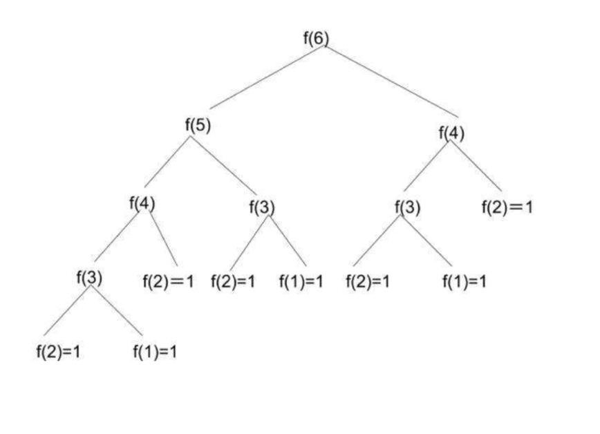
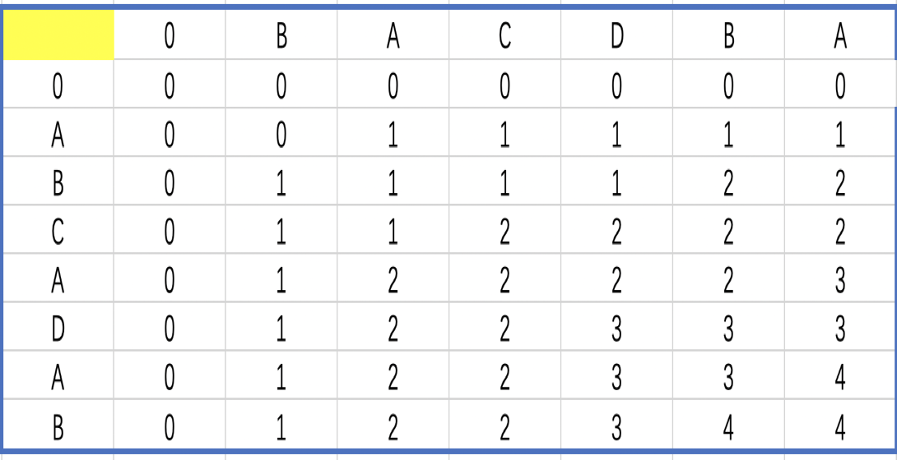
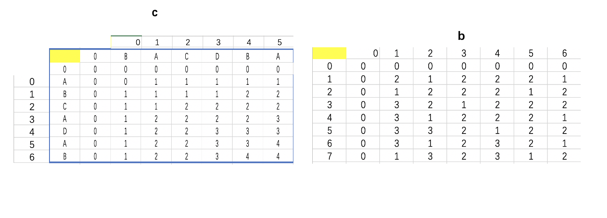

# 动态规划学习日志

### 1、什么是动态规划

​        动态规划的本质是将一个大的问题分解成多个相互之间非独立的子问题，通过自底而上的求解子问题获得一个大的问题的解的过程。我们举斐波那契的兔子问题为例：


##### 问题描述

​       假设第1个月有1对刚诞生的兔子，第2个月进入成熟期，第3个月开始生育兔子，而1对成熟的兔子每月会生1对兔子，那么6个月后会有多少对兔子？

##### 解：

分析问题的解的结构特征，我们可以发现问题解的结构特征为：
$$
F(n)=\begin{cases} 1&,n=1  \\1&,n=2\\F(n-1)+F(n-2)&,n>2\end{cases}
$$

[^F(n)]: 表示第n天的兔子总数


​       通过分析问题解的结构特征，我们发现想要知道第6天有多少只兔子，那么就需要知道第5和第4天有多少只兔子，如果想知道第5和第4天有多少只兔子就分别需要知道第4、第3天和第3、第2天分别有所少只兔子等等，通过以上的方式，我们就将一个大的问题分解为多个小的问题，见下图：

​       想上面这样，可以将一个大的问题划分为多个非独立的子问题并通过求子问题的解进而求出大问题解的问题就是动态规划问题。

### 2、为什么学习动态规划

​        动态规划问题同分治法非常类似，都是将一个大问题分解成子问题，最后求出大问题的解（最优子结构），但是区别在于分治问题的子问题大多相互独立，而动态规划的子问题存在重叠情况,通过一个记录数组记录子问题的解，可以避免过多的重复计算。

##### 使用分治

```
Fib(int n){
    if(n==1||n==2)
       return 1;
    return Fib(n-1)+Fib(n-2)
}
```

##### 使用动态规划

```
Fib(int n){
    int *a=new int[n];
    a[1]=1;
    a[2]=1;
    for(int i=3;i<=n;i++)
        a[i]=a[i-1]+a[i-2];
    return a[n];
}
```


#### 3、动态规划案例分析

##### 问题：

给定两个序列X={x1,x2,x3,…,xm},和Y={y1,y2,y3,…,yn}求出X和Y的最长公共子序列长度和。例如:X=(A,B,C,B,A,D,B),Y=(B,C,B,A,A,C),那么最长公共子序列长度为4，子序列为B,C,B,A 。


解题步骤：

•  分析最优解的结构特征

•  建立最优解的递归式

•  自底向上计算最优解

•  构造最优解


##### 分析：

(1)分析最优解的结构特征

•假设Z k={z1,z2,z3,…,z k}是X={x1,x2,x3,…,x m}和Y={y1,y2,y3,…,y n}的最长公共子序列，那么会出现3种情况：

1）. x m=y n=z k:那么Zk-1={z1,z2,z3,…,zk-1}是Xm-1和Yn-1的最长公共子序列；

2）. x m != y n, x m!=z k:那么Z k是Xm-1和Y n的最长公共子序列；

3）x m != y n, y n!=z k:那么Z k是X m和Yn-1的最长公共子序列；

(2)建立最优值的递归式

•设c\[i][j]表示Xi和Y j的最长公共子序列长度

  x m=y n=z k:那么c\[ i ][ j ]=c\[ i-1 ][ j-1 ]+1

•X m!=y n:那么我们只需要求解Xi和Yj-1的最长公共子序列和Xi-1和Yj的最长公共子序列，比较它们的长度哪一个更大，就取哪一个值。即c\[i][j]=max{c\[i][j-1],c\[i-1][j]}
$$
F(n)=\begin{cases} 0&,i=0或j=0  \\c[i-1][j-1]+1&,i,j>0且x_i=y_j\\max\{c[i][j-1],c[i-1][j]&,i,j>0且x_i!=y_j\end{cases}
$$
(3)自底向上计算最优解



(4)构造最优解

•上面只是知道了最优解是4但是不知道4是怎么来的，以及最长子序列是什么，分析：

​     当Xi=Y j时，c\[i][j]=c\[i-1][j-1]+1

​     当Xi！=Y j时，c\[i][j]=max{c\[i][j-1],c\[i-1][j]}

•那么，可以通过构建一个辅助数组b[i][j]来记录这三种情况，

​     c\[i][j]=c\[i-1][j-1]+1时,  b\[i][j]=1;

​     c\[i][j]= c\[i][j-1]时,  b\[i][j]=2;

​     c\[i][j]= c\[i-1][j],  b\[i][j]=3;

#### 发生了什么



通过追中b中1的的位置知道公共子序列是什么.

##### 代码实现

```
#include <iostream>
#include <cstring>

using namespace std;

const int N = 1002;
int c[N][N], b[N][N];
char s1[N], s2[N];
int len1, len2;

void LCSL() {
    int i, j;
    for (i = 1; i <= len1; i++)//控制s1序列
        for (j = 1; j <= len2; j++)//控制s2序列
        {
            if (s1[i - 1] == s2[j - 1]) {//如果当前字符串相同，则公共子序列的长度为该字符前的最长公共子序列+1
                c[i][j] = c[i - 1][j - 1] + 1;
                b[i][j] = 1;
            } else {
                if (c[i][j - 1] >= c[i - 1][j]) {
                    c[i][j] = c[i][j - 1];
                    b[i][j] = 2;
                } else {
                    c[i][j] = c[i - 1][j];
                    b[i][j] = 3;
                }
            }

        }
}

void print(int i, int j) {
    if (i == 0 || j == 0) return;
    if (b[i][j] == 1) {
        print(i - 1, j - 1);
        cout << s1[i - 1];
    } else if (b[i][j] == 2)
        print(i, j - 1);
    else
        print(i - 1, j);
}

int main() {
    //std::cout << "Hello, World!" << std::endl;
    int i, j;
    cout << "请输入字符串s1:" << endl;
    cin >> s1;
    cout << "请输入字符串s2:" << endl;
    cin >> s2;

    len1 = strlen(s1);//计算两个字符串的长度
    len2 = strlen(s2);

    for (i = 0; i <= len1; i++) c[i][0] = 0;//初始化第一列为0
    for (j = 0; j <= len2; j++) c[0][j] = 0;//初始化第一行为0

    LCSL();//求最长公共子序列
    cout << "s1和s2的最长公共子序列长度是：" << c[len1][len2] << endl;
    cout << "s1和s2的最长公共子序列是：";
    print(len1, len2);
    return 0;
}

```

